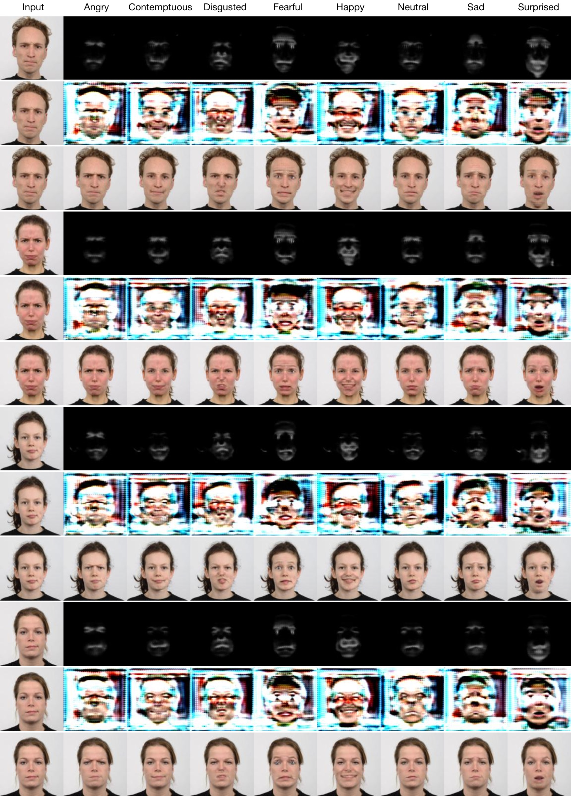
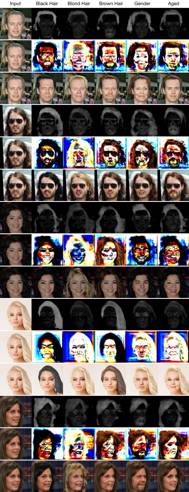

This repository provides a PyTorch implementation of StarGAN + AttentionGAN-v1 for the Multi-Domain Image-to-Image Translation. StarGAN can flexibly translate an input image to any desired target domain using only a single generator and a discriminator. 

<p align="center"></p>
Order: The Learned Attention Mask, The Learned Content Mask, Final Results.

<p align="center"></p>
Order: The Learned Attention Mask, The Learned Content Mask, Final Results.

## Dependencies
* [Python 3.5+](https://www.continuum.io/downloads)
* [PyTorch 0.4.0+](http://pytorch.org/)
* [TensorFlow 1.3+](https://www.tensorflow.org/) (optional for tensorboard)

## Usage

### 1. Cloning the repository
```bash
$ git clone https://github.com/Ha0Tang/AttentionGAN
$ cd AttentionGAN/
$ cd AttentionGAN-v1-multi/
```

### 2. Downloading the dataset
To download the CelebA dataset:
```bash
$ bash download_dataset.sh celeba
```

To download the RaFD dataset, you must request access to the dataset from [the Radboud Faces Database website](http://www.socsci.ru.nl:8180/RaFD2/RaFD?p=main). Then, you need to create a folder structure as described [here](./jpg/RaFD.md).

### 3. Training
To train StarGAN on CelebA, run the training script below. See [here](./jpg/CelebA.md) for a list of selectable attributes in the CelebA dataset. If you change the `selected_attrs` argument, you should also change the `c_dim` argument accordingly.

To train StarGAN on RaFD:

```bash
$ python main.py --mode train --dataset RaFD --image_size 128 --c_dim 8 \
                 --sample_dir stargan_rafd/samples --log_dir stargan_rafd/logs \
                 --model_save_dir stargan_rafd/models --result_dir stargan_rafd/results
```

To train StarGAN on CelebA:

```bash
$ python main.py --mode train --dataset CelebA --image_size 128 --c_dim 5 \
                 --sample_dir stargan_celeba/samples --log_dir stargan_celeba/logs \
                 --model_save_dir stargan_celeba/models --result_dir stargan_celeba/results \
                 --selected_attrs Black_Hair Blond_Hair Brown_Hair Male Young
```

For more training options, please refer to [StarGAN](https://github.com/yunjey/stargan). 

### 4. Testing

To test StarGAN on RaFD:

```bash
$ python main.py --mode test --dataset RaFD --image_size 128 \
                 --c_dim 8 --rafd_image_dir data/RaFD/test \
                 --sample_dir stargan_rafd/samples --log_dir stargan_rafd/logs \
                 --model_save_dir stargan_rafd/models --result_dir stargan_rafd/results
```

To test StarGAN on CelebA:

```bash
$ python main.py --mode test --dataset CelebA --image_size 128 --c_dim 5 \
                 --sample_dir stargan_celeba/samples --log_dir stargan_celeba/logs \
                 --model_save_dir stargan_celeba/models --result_dir stargan_celeba/results \
                 --selected_attrs Black_Hair Blond_Hair Brown_Hair Male Young
```


### 5. Pretrained model
To download a pretrained model checkpoint, run the script below. The pretrained model checkpoint will be downloaded and saved into `./rafd_128_pretrained/models` directory.

```bash
$ bash download_pretrained.sh rafd_128
$ bash download_pretrained.sh rafd_256
$ bash download_pretrained.sh celeba_128
$ bash download_pretrained.sh celeba_256
```

To translate images using the pretrained model, run the evaluation script below. The translated images will be saved into `./rafd_128_pretrained/results` directory.

```bash
$ python main.py --mode test --dataset RaFD --image_size 128 --c_dim 8 \
                 --model_save_dir='rafd_128_pretrained/models' \
                 --result_dir='rafd_128_pretrained/results'
```

The model pretrained by the original StarGAN on RaFD dataset with 256 resolution can by downloaded by using,
```bash
$ bash download_pretrained.sh stargan_rafd_256 
```
Then use the original [StarGAN](https://github.com/yunjey/stargan) code to generated results.

## Citation
If you use this code for your research, please cite our papers.
```
@article{tang2019attentiongan,
  title={AttentionGAN: Unpaired Image-to-Image Translation using Attention-Guided Generative Adversarial Networks},
  author={Tang, Hao and Liu, Hong and Xu, Dan and Torr, Philip HS and Sebe, Nicu},
  journal={arXiv preprint arXiv:1911.11897},
  year={2019}
}

@inproceedings{tang2019attention,
  title={Attention-Guided Generative Adversarial Networks for Unsupervised Image-to-Image Translation},
  author={Tang, Hao and Xu, Dan and Sebe, Nicu and Yan, Yan},
  booktitle={International Joint Conference on Neural Networks (IJCNN)},
  year={2019}
}
```

<br/>

## Acknowledgments
This source code is inspired by [StarGAN](https://github.com/yunjey/stargan). 

## Contributions
If you have any questions/comments/bug reports, feel free to open a github issue or pull a request or e-mail to the author Hao Tang ([hao.tang@unitn.it](hao.tang@unitn.it)).

