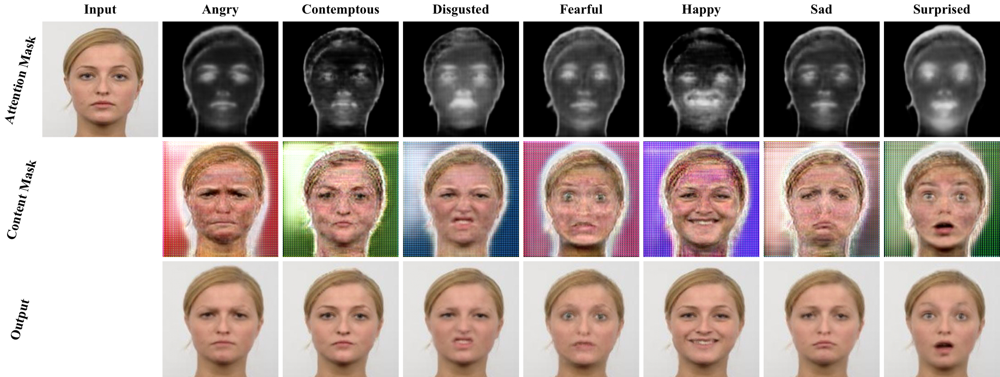

[](https://github.com/Ha0Tang/AttentionGAN/blob/master/LICENSE.md)


[]((https://github.com/Ha0Tang/AttentionGAN/graphs/commit-activity))


<!-- [](https://GitHub.com/Ha0Tang/AttentionGAN/issues/) -->

 

<!-- 
Comparison with different baselines on Bu3dfe dataset.<br>  -->

# Attention-Guided GANs (AGGAN) for Unsupervised Image-to-Image Translation

## AGGAN Framework
 <br> 

## Visualization of Attention Mask and Content Mask 
 <br> 

### [Paper](https://arxiv.org/abs/1903.12296) | [Project page](http://disi.unitn.it/~hao.tang/project/AttentionGAN.html) | [Slides](http://disi.unitn.it/~hao.tang/uploads/slides/Attention_IJCNN19.pptx) <br>
Attention-Guided Generative Adversarial Networks for Unsupervised Image-to-Image Translation. <br>
[Hao Tang](http://disi.unitn.it/~hao.tang/)<sup>1</sup>, [Dan Xu](http://www.robots.ox.ac.uk/~danxu/)<sup>2</sup>, [Nicu Sebe](http://disi.unitn.it/~sebe/)<sup>1</sup>, [Yan Yan](https://userweb.cs.txstate.edu/~y_y34/)<sup>3</sup>.<br> 
<sup>1</sup>University of Trento, Italy, <sup>2</sup>University of Oxford, UK, <sup>3</sup>Texas State University, USA<br>
In [IJCNN 2019](https://www.ijcnn.org/) (Oral) <br>
The repository offers the official implementation of our paper in PyTorch.

### [License](https://github.com/Ha0Tang/AGGAN/blob/master/LICENSE.md)

Copyright (C) 2019 University of Trento, Italy.

All rights reserved.
Licensed under the [CC BY-NC-SA 4.0](https://creativecommons.org/licenses/by-nc-sa/4.0/legalcode) (**Attribution-NonCommercial-ShareAlike 4.0 International**)

The code is released for academic research use only. For commercial use, please contact [hao.tang@unitn.it](hao.tang@unitn.it).


## Prerequisites
Code is intended to work with ```Python 3.6.x```, it hasn't been tested with previous versions.

### [PyTorch 0.3.1 & Torchvision](http://pytorch.org/)
Follow the instructions in [pytorch.org](http://pytorch.org) for your current setup.

Note: Make sure that your PyTorch's version is 0.3.1. Later I will update it to 0.4 if I have time.

### [Visdom](https://github.com/facebookresearch/visdom)
To plot loss graphs and draw images in a nice web browser view:
```
pip install visdom
```

## Training & Testing
### 1. Setup the dataset
First, you will need to build your datasets by setting up the following directory structure:

    .
    ├── datasets                   
    |   ├── <dataset_name>         # i.e., bu3dfe_neutral2happiness
    |   |   ├── train              # Training
    |   |   |   ├── A              # Contains domain A images (i.e., neutral)
    |   |   |   └── B              # Contains domain B images (i.e., happiness)
    |   |   └── test               # Testing
    |   |   |   ├── A              # Contains domain A images (i.e., neutral)
    |   |   |   └── B              # Contains domain B images (i.e., happiness)

Examples of the dataset is shown in [this folder](https://github.com/Ha0Tang/AGGAN/tree/master/datasets/bu3dfe_neutral2happiness).

### 2. Training
```
export CUDA_VISIBLE_DEVICES=X; 
python train.py --dataroot datasets/<dataset_name>/ --save_name <save_name> --cuda
```
This command will start a training session using the images under the *dataroot/train* directory with the default hyperparameters. You are free to change those hyperparameters, see ```./train --help``` for a description of those.

Both generators and discriminators weights will be saved under the output directory.

If you don't own a GPU remove the --cuda option, although I advise you to get one!

You can also view the training progress as well as live output images by running ```python -m visdom``` in another terminal and opening [http://localhost:8097/](http://localhost:8097/) in your favourite web browser.

### 3. Testing
```
python test.py --dataroot datasets/<dataset_name>/ --save_name <save_name> --cuda
```
This command will take the images under the `dataroot/test` directory, run them through the generators and save the output under the `output/A` and `output/B` directories. As with training, some parameters like the weights to load, can be tweaked, see ```./test --help``` for more information.

## Code Structure

- `train.py`, `test.py`: the entry point for training and testing.
- `models.py`: defines the architecture of all models for AttentionGAN
- `datasets.py`: defines the class for loading images.
- `utils.py`: consists of several helper functions.

## Citation
If you use this code for your research, please cite our papers.
```
@inproceedings{tang2019attention,
  title={Attention-Guided Generative Adversarial Networks for Unsupervised Image-to-Image Translation},
  author={Tang, Hao and Xu, Dan and Sebe, Nicu and Yan, Yan},
  booktitle={International Joint Conference on Neural Networks (IJCNN)},
  year={2019}
}
```

## Acknowledgments
This source code borrows heavily from [CycleGAN](https://github.com/junyanz/pytorch-CycleGAN-and-pix2pix). We acknowledge the National Institute of
Standards and Technology Grant 60NANB17D191 for funding this research. We also acknowledge the gift donation from Cisco, Inc for this research.

## Related Projects (Image-to-Image Translation)
### 1. Supervised image-to-image translation methods.
[Pix2pix](https://github.com/junyanz/pytorch-CycleGAN-and-pix2pix)<br> 
[SelectionGAN](https://github.com/Ha0Tang/SelectionGAN)<br>
[Pix2pixHD](https://github.com/NVIDIA/pix2pixHD)<br>
[SPADE](https://github.com/NVlabs/SPADE)<br>
[BiCycleGAN](https://github.com/junyanz/BicycleGAN)<br> 
[Encoder-Decoder](https://github.com/phillipi/pix2pix)<br> 

### 2. Unsupervised image-to-image translation methods.
[CycleGAN](https://github.com/junyanz/pytorch-CycleGAN-and-pix2pix)<br> 
[DiscoGAN](https://github.com/SKTBrain/DiscoGAN)<br>
[DualGAN](https://github.com/duxingren14/DualGAN)<br>
[DistancGAN](https://github.com/sagiebenaim/DistanceGAN)<br>
[ComboGAN](https://github.com/AAnoosheh/ComboGAN)<br>
[StarGAN](https://github.com/yunjey/stargan)<br>

### 3. Label-, mask- or attention-guided image translation methods.
[IcGAN](https://github.com/Guim3/IcGAN)<br>
[GANimation](https://github.com/albertpumarola/GANimation)<br>
[Unsupervised-Attention-guided-Image-to-Image-Translation](https://github.com/AlamiMejjati/Unsupervised-Attention-guided-Image-to-Image-Translation) or [PyTorch Version](https://github.com/alokwhitewolf/Pytorch-Attention-Guided-CycleGAN)<br>
[InstaGAN](https://github.com/sangwoomo/instagan)<br>

## Contributions
If you have any questions/comments/bug reports, feel free to open a github issue or pull a request or e-mail to the author Hao Tang ([hao.tang@unitn.it](hao.tang@unitn.it)).
