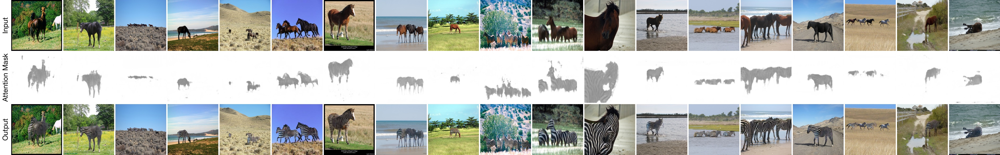
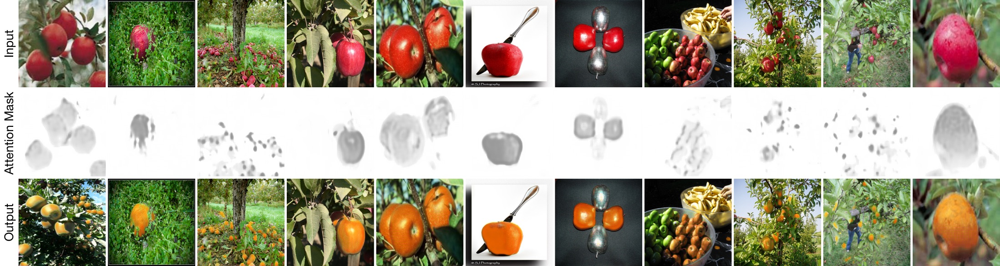
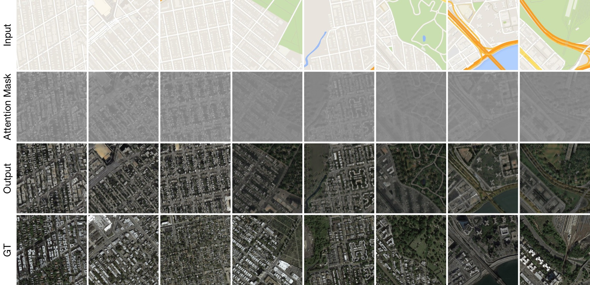
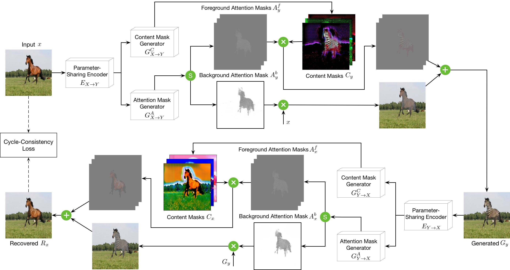

[](https://github.com/Ha0Tang/AttentionGAN/blob/master/LICENSE.md)


[]((https://github.com/Ha0Tang/AttentionGAN/graphs/commit-activity))


# Visualizarion of Learned Attention Masks  
## Horse to Zebra Translation


## Apple to Orange Translation


## Map to Aerial Photo Translation


# AttentionGAN-v2 for Unpaird Image-to-Image Translation

## AttentionGAN-v2 Framework


Code is coming soon. For AttentionGAN-v1, please refer to [this folder](./AttentionGAN-v1).

### [Project page](http://disi.unitn.it/~hao.tang/project/AttentionGAN-v2.html) | [Paper](https://arxiv.org/abs/1808)

AttentionGAN: Unpaired Image-to-Image Translation usingAttention-Guided Generative Adversarial Networks.<br>
[Hao Tang](http://disi.unitn.it/~hao.tang/)<sup>1</sup>, [Hong Liu](https://scholar.google.com/citations?user=4CQKG8oAAAAJ&hl=en)<sup>2</sup>, [Dan Xu](http://www.robots.ox.ac.uk/~danxu/)<sup>3</sup>, [Philip H.S. Torr](https://scholar.google.com/citations?user=kPxa2w0AAAAJ&hl=en)<sup>3</sup> and [Nicu Sebe](http://disi.unitn.it/~sebe/)<sup>1</sup>. <br> 
<sup>1</sup>University of Trento, Italy, <sup>2</sup>Peking University, China, <sup>3</sup>University of Oxford, UK.<br>
The repository offers the official implementation of our paper in PyTorch.

### [License](./LICENSE.md)

Copyright (C) 2019 University of Trento, Italy.

All rights reserved.
Licensed under the [CC BY-NC-SA 4.0](https://creativecommons.org/licenses/by-nc-sa/4.0/legalcode) (**Attribution-NonCommercial-ShareAlike 4.0 International**)

The code is released for academic research use only. For commercial use, please contact [hao.tang@unitn.it](hao.tang@unitn.it).

## Installation

Clone this repo.
```bash
git clone https://github.com/Ha0Tang/AttentionGAN
cd AttentionGAN/
```

This code requires PyTorch 0.4.1 and python 3.6+. Please install dependencies by
```bash
pip install -r requirements.txt (for pip users)
```
or 

```bash
./scripts/conda_deps.sh (for Conda users)
```

To reproduce the results reported in the paper, you would need one NVIDIA TITAN Xp GPUs.

## Dataset Preparation

## Generating Images Using Pretrained Model

Once the dataset is ready. The result images can be generated using pretrained models.

## Training New Models

New models can be trained with the following commands.

## Testing

## Code Structure

- `train.py`, `test.py`: the entry point for training and testing.
- `models/gesturegan_onecycle_model.py`, `models/gesturegan_twocycle_model.py`: creates the networks, and compute the losses.
- `models/networks/`: defines the architecture of all models for GestureGAN.
- `options/`: creates option lists using `argparse` package.
- `data/`: defines the class for loading images and controllable structures.
- `scripts/evaluation`: several evaluation codes.

## Evaluation Code

We use several metrics to evaluate the quality of the generated images:

## Ecaluation Code
- [FID](https://github.com/bioinf-jku/TTUR): Official Implementation
- [KID](https://github.com/taki0112/GAN_Metrics-Tensorflow): Suggested by [UGATIT](https://github.com/taki0112/UGATIT/issues/64). 
  Install Steps: `conda create -n python36 pyhton=3.6 anaconda` and `pip install --ignore-installed --upgrade tensorflow==1.13.1`

<!-- ## Citation
If you use this code for your research, please cite our papers.
```
@inproceedings{tang2018gesturegan,
  title={GestureGAN for Hand Gesture-to-Gesture Translation in the Wild},
  author={Tang, Hao and Wang, Wei and Xu, Dan and Yan, Yan and Sebe, Nicu},
  booktitle={ACM MM},
  year={2018}
}
``` -->

## Acknowledgments
This source code is inspired by [CycleGAN](https://github.com/junyanz/pytorch-CycleGAN-and-pix2pix). 

<!-- ## Related Projects (Unpaired Image-to-Image Translation) --> -->

## Contributions
If you have any questions/comments/bug reports, feel free to open a github issue or pull a request or e-mail to the author Hao Tang ([hao.tang@unitn.it](hao.tang@unitn.it)).

