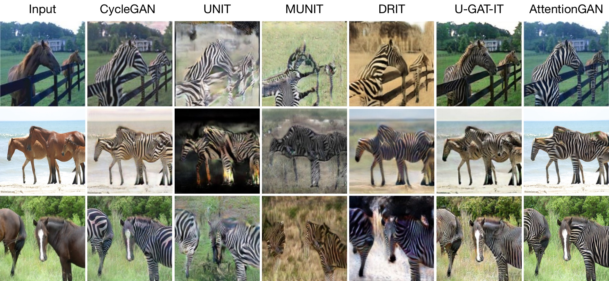
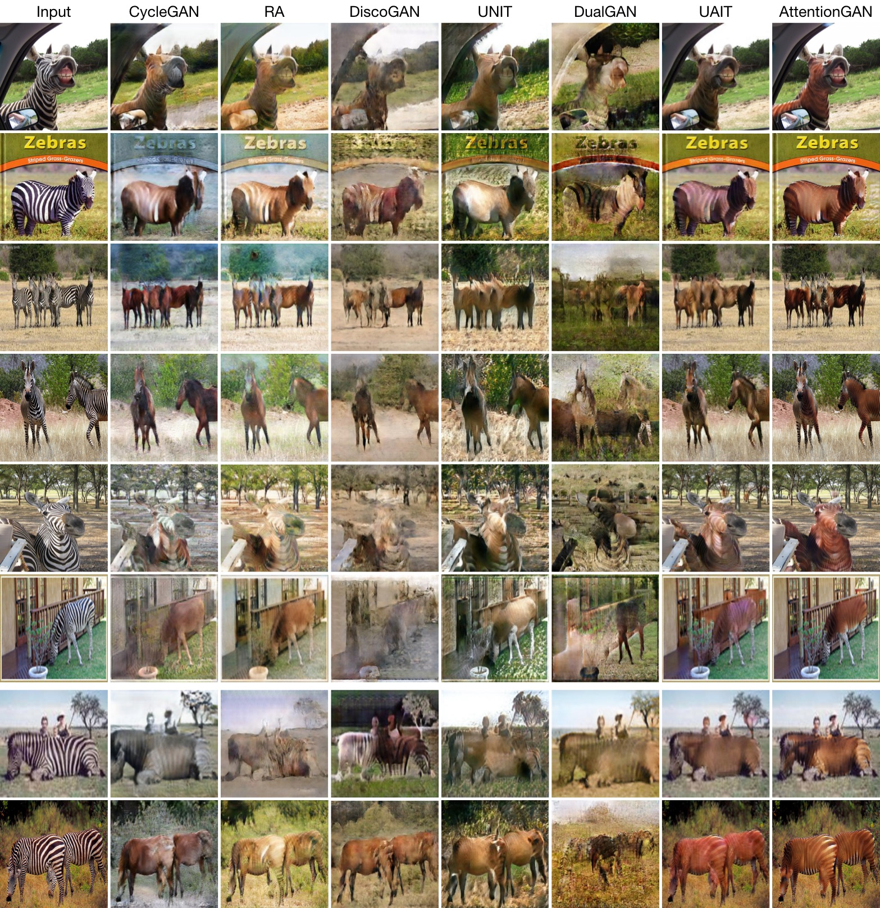
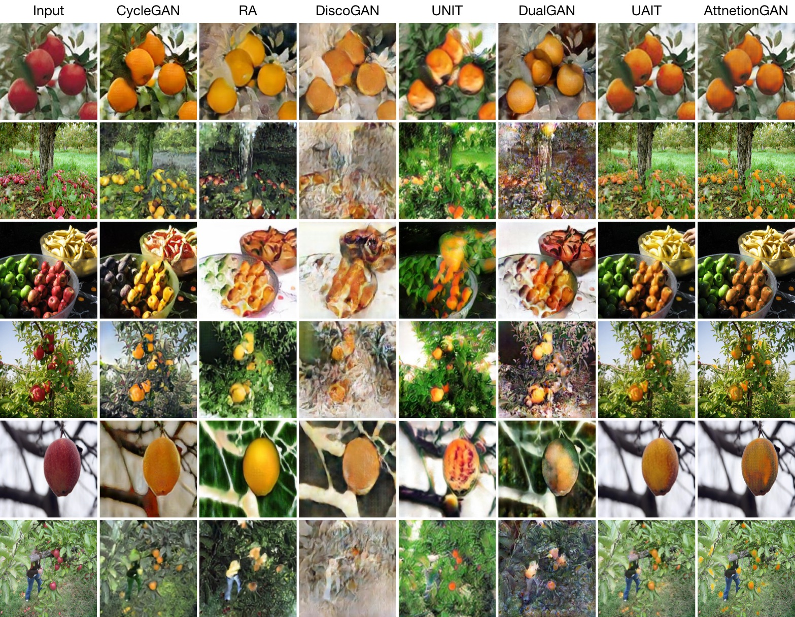
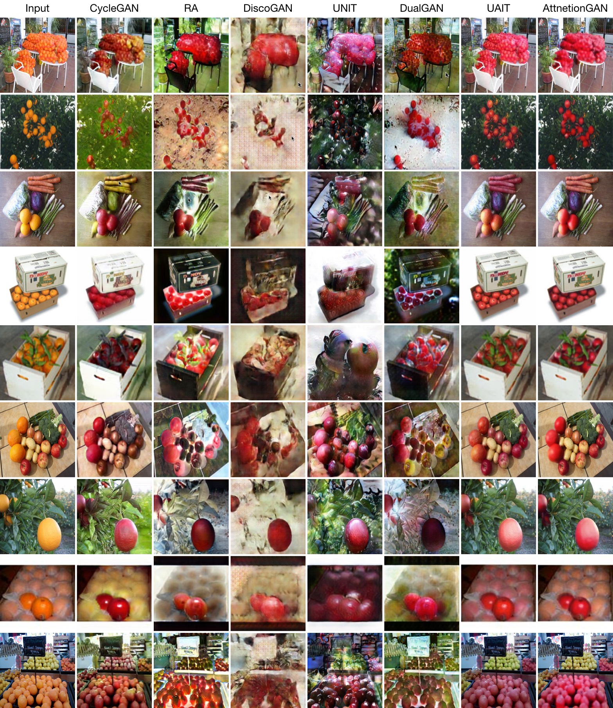
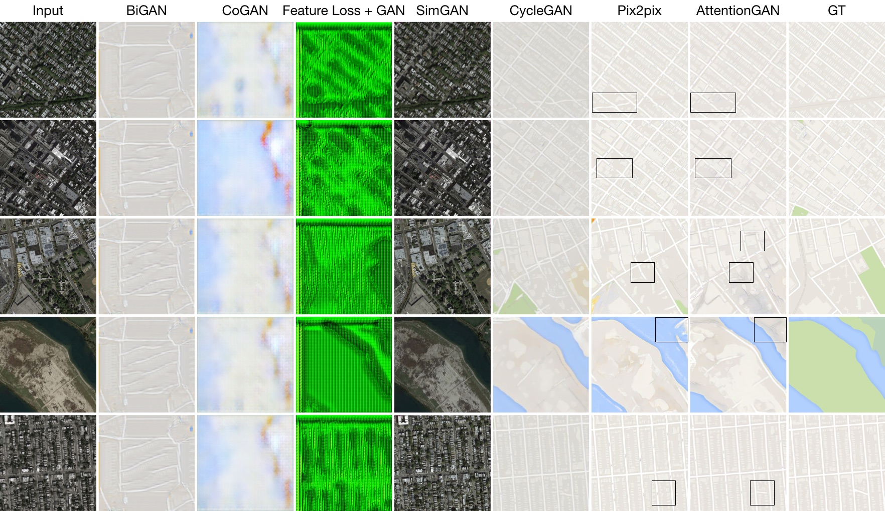
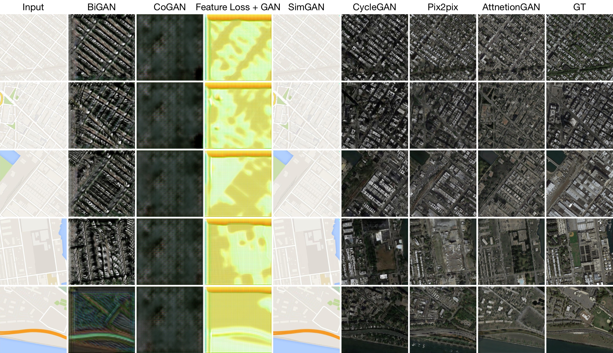
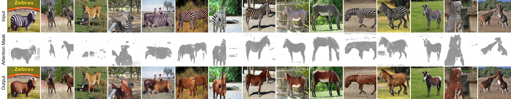
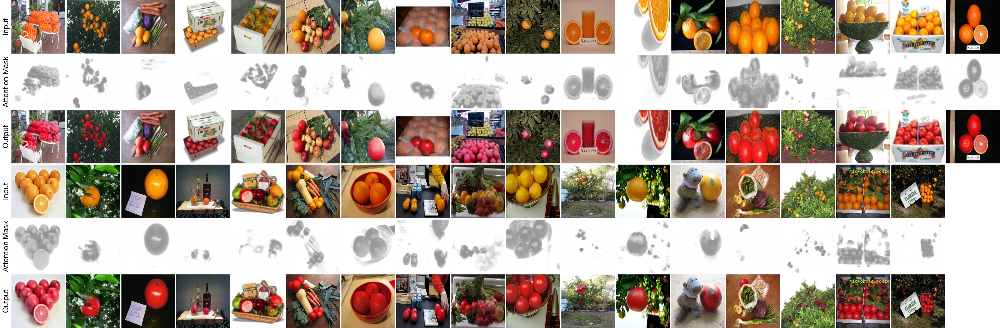
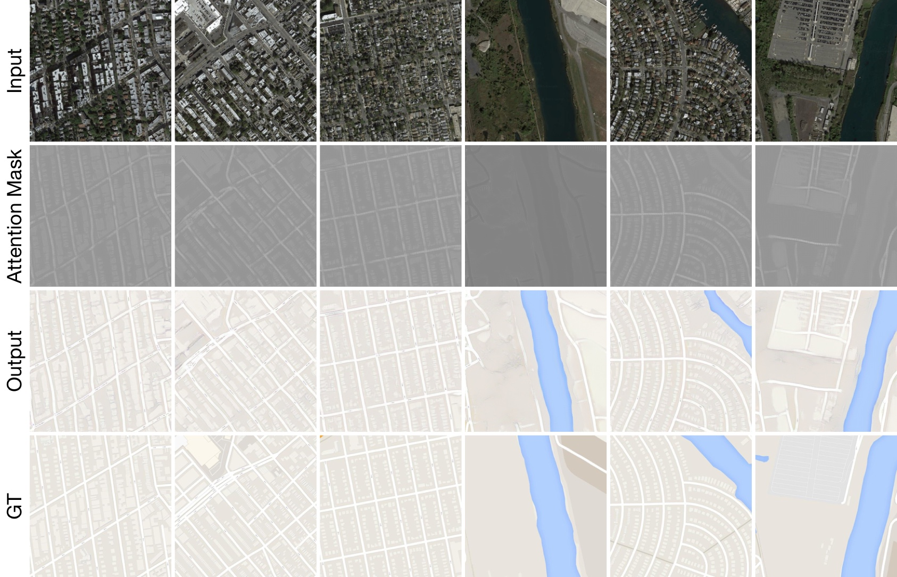
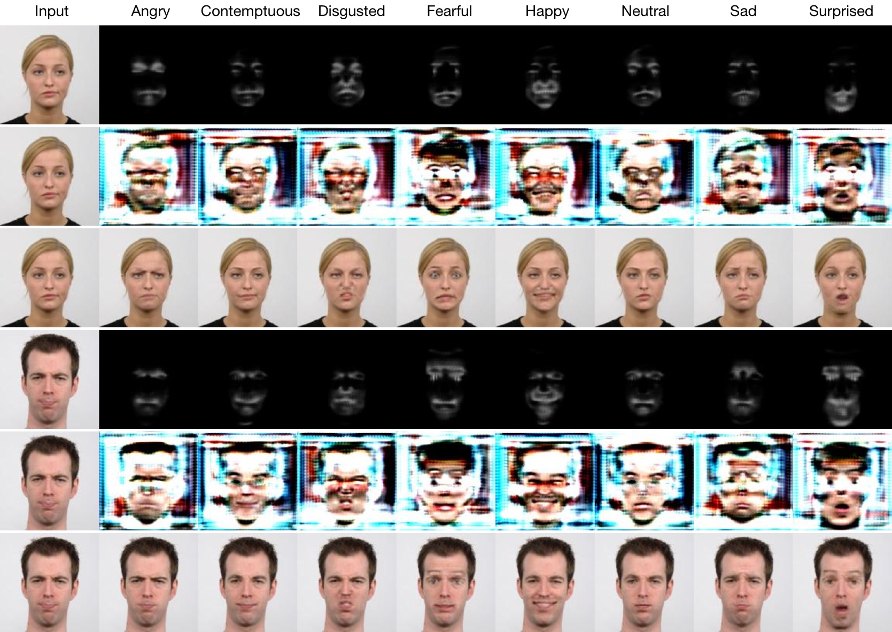

[](https://github.com/Ha0Tang/AttentionGAN/blob/master/LICENSE.md)


[]((https://github.com/Ha0Tang/AttentionGAN/graphs/commit-activity))


# AttentionGAN-v2 for Unpaired Image-to-Image Translation

## AttentionGAN-v2 Framework
The proposed generator learns both foreground and background attentions. It uses the foreground attention to select from the generated output for the foreground regions, while uses the background attention to maintain the background information from the input image. For refer to our papers for more details.


## Comparsion with State-of-the-Art Methods
### Horse to Zebra Translation

<br>


### Zebra to Horse  Translation


### Apple to Orange Translation


### Orange to Apple  Translation


### Map to Aerial Photo Translation


### Aerial Photo to Map Translation


## Visualization of Learned Attention Masks  
### Horse to Zebra Translation


### Zebra to Horse Translation


### Apple to Orange Translation


### Orange to Apple  Translation


### Map to Aerial Photo Translation


### Aerial Photo to Map Translation


### [Paper](https://128.84.21.199/abs/1911.11897)

AttentionGAN: Unpaired Image-to-Image Translation using Attention-Guided Generative Adversarial Networks.<br>
[Hao Tang](http://disi.unitn.it/~hao.tang/)<sup>1</sup>, [Hong Liu](https://scholar.google.com/citations?user=4CQKG8oAAAAJ&hl=en)<sup>2</sup>, [Dan Xu](http://www.robots.ox.ac.uk/~danxu/)<sup>3</sup>, [Philip H.S. Torr](https://scholar.google.com/citations?user=kPxa2w0AAAAJ&hl=en)<sup>3</sup> and [Nicu Sebe](http://disi.unitn.it/~sebe/)<sup>1</sup>. <br> 
<sup>1</sup>University of Trento, Italy, <sup>2</sup>Peking University, China, <sup>3</sup>University of Oxford, UK.<br>
The repository offers the official implementation of our paper in PyTorch.

#### Are you looking for AttentionGAN-v1 for Unpaired Image-to-Image Translation?
> [Paper](https://arxiv.org/abs/1903.12296) | [Code](./AttentionGAN-v1)

#### Are you looking for AttentionGAN-v1 for Multi-Domain Image-to-Image Translation such as Facial Expression-to-Expression Translation?
> [Paper](https://arxiv.org/abs/1903.12296) | [Code](./AttentionGAN-v1-multi)


Order: The Learned Attention Masks, The Learned Content Masks, Final Results

### [License](./LICENSE.md)

Copyright (C) 2019 University of Trento, Italy.

All rights reserved.
Licensed under the [CC BY-NC-SA 4.0](https://creativecommons.org/licenses/by-nc-sa/4.0/legalcode) (**Attribution-NonCommercial-ShareAlike 4.0 International**)

The code is released for academic research use only. For commercial use, please contact [hao.tang@unitn.it](hao.tang@unitn.it).

## Installation

Clone this repo.
```bash
git clone https://github.com/Ha0Tang/AttentionGAN
cd AttentionGAN/
```

This code requires PyTorch 0.4.1+ and python 3.6.9+. Please install dependencies by
```bash
pip install -r requirements.txt (for pip users)
```
or 

```bash
./scripts/conda_deps.sh (for Conda users)
```

To reproduce the results reported in the paper, you would need an NVIDIA TITAN Xp GPUs.

## Dataset Preparation
Download the datasets using the following script. Please cite their paper if you use the data.
```
bash ./datasets/download_cyclegan_dataset.sh dataset_name
```

## AttentionGAN Training/Testing
- Download a dataset using the previous script (e.g., horse2zebra).
- To view training results and loss plots, run `python -m visdom.server` and click the URL [http://localhost:8097](http://localhost:8097).
- Train a model:
```
bash ./scripts/train_attentiongan.sh
```
- To see more intermediate results, check out `./checkpoints/horse2zebra_attentiongan/web/index.html`.
- How to continue train? Append `--continue_train --epoch_count xxx` on the command line.
- Test the model:
```
bash ./scripts/test_attentiongan.sh
```
- The test results will be saved to a html file here: `./results/horse2zebra_attentiongan/latest_test/index.html`.

## Generating Images Using Pretrained Model
- You need download a pretrained model (e.g., horse2zebra) with the following script:
```
bash ./scripts/download_attentiongan_model.sh horse2zebra
```
- The pretrained model is saved at `./checkpoints/{name}_pretrained/latest_net_G.pth`. 
- Then generate the result using
```
python test.py --dataroot ./datasets/horse2zebra --name horse2zebra_pretrained --model attention_gan --dataset_mode unaligned --norm instance --phase test --no_dropout --load_size 256 --crop_size 256 --batch_size 1 --gpu_ids 0 --num_test 5000 --epoch latest --saveDisk
```
The results will be saved at `./results/`. Use `--results_dir {directory_path_to_save_result}` to specify the results directory. Note that if you want to save the intermediate results and have enough disk space, remove `--saveDisk` on the command line.

- For your own experiments, you might want to specify --netG, --norm, --no_dropout to match the generator architecture of the trained model.

## Evaluation Code
- [FID](https://github.com/bioinf-jku/TTUR): Official Implementation
- [KID](https://github.com/taki0112/GAN_Metrics-Tensorflow): Suggested by [UGATIT](https://github.com/taki0112/UGATIT/issues/64). 
  Install Steps: `conda create -n python36 pyhton=3.6 anaconda` and `pip install --ignore-installed --upgrade tensorflow==1.13.1`

## Citation
If you use this code for your research, please cite our papers.
```
@article{tang2019attentiongan,
  title={AttentionGAN: Unpaired Image-to-Image Translation using Attention-Guided Generative Adversarial Networks},
  author={Tang, Hao and Liu, Hong and Xu, Dan and Torr, Philip HS and Sebe, Nicu},
  journal={arXiv preprint arXiv:1911.11897},
  year={2019}
}

@inproceedings{tang2019attention,
  title={Attention-Guided Generative Adversarial Networks for Unsupervised Image-to-Image Translation},
  author={Tang, Hao and Xu, Dan and Sebe, Nicu and Yan, Yan},
  booktitle={International Joint Conference on Neural Networks (IJCNN)},
  year={2019}
}
```

## Acknowledgments
This source code is inspired by [CycleGAN](https://github.com/junyanz/pytorch-CycleGAN-and-pix2pix) and [SelectionGAN](https://github.com/Ha0Tang/SelectionGAN). 

## Contributions
If you have any questions/comments/bug reports, feel free to open a github issue or pull a request or e-mail to the author Hao Tang ([hao.tang@unitn.it](hao.tang@unitn.it)).

