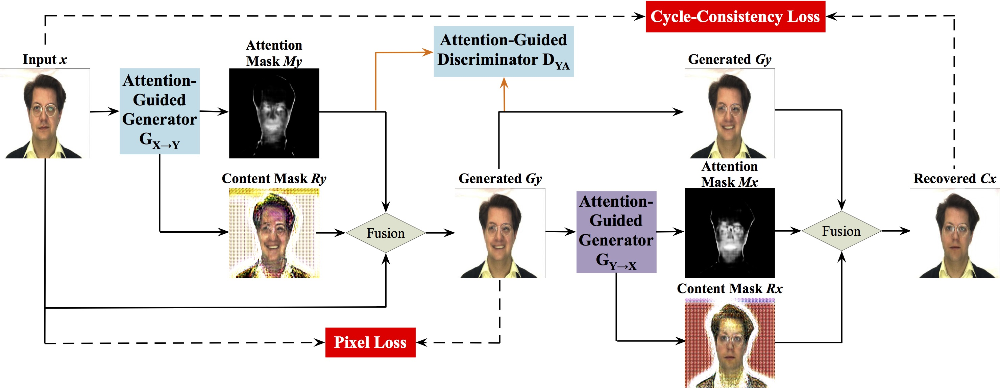

# Attention-Guided GANs (AGGAN) for Unsupervised Image-to-Image Translation

## AGGAN Framework


[Paper](https://arxiv.org/abs/1903.12296)

Attention-Guided Generative Adversarial Networks for Unsupervised Image-to-Image Translation.<br>
[Hao Tang](http://disi.unitn.it/~hao.tang/)<sup>1</sup>, [Dan Xu](http://www.robots.ox.ac.uk/~danxu/)<sup>2</sup>, [Nicu Sebe](http://disi.unitn.it/~sebe/)<sup>1</sup>, [Yan Yan](https://userweb.cs.txstate.edu/~y_y34/)<sup>3</sup>.<br> 
<sup>1</sup>University of Trento, Italy, <sup>2</sup>University of Oxford, UK, <sup>3</sup>Texas State University, USA
In [IJCNN 2019](https://www.ijcnn.org/) (Oral) <br>
The repository offers the implementation of our paper in PyTorch.


## Prerequisites
Code is intended to work with ```Python 3.6.x```, it hasn't been tested with previous versions

### [PyTorch 0.3.1 & torchvision](http://pytorch.org/)
Follow the instructions in [pytorch.org](http://pytorch.org) for your current setup

Note: Make sure that your PyTorch's version is 0.3.1. Later I will update it to 0.4 if I have time.

### [Visdom](https://github.com/facebookresearch/visdom)
To plot loss graphs and draw images in a nice web browser view
```
pip3 install visdom
```

## Training
### 1. Setup the dataset
First, you will need to build your datasets by setting up the following directory structure:

    .
    ├── datasets                   
    |   ├── <dataset_name>         # i.e. brucewayne2batman
    |   |   ├── train              # Training
    |   |   |   ├── A              # Contains domain A images (i.e. Bruce Wayne)
    |   |   |   └── B              # Contains domain B images (i.e. Batman)
    |   |   └── test               # Testing
    |   |   |   ├── A              # Contains domain A images (i.e. Bruce Wayne)
    |   |   |   └── B              # Contains domain B images (i.e. Batman)

Examples of the dataset is shown in [this folder](https://github.com/Ha0Tang/AGGAN/tree/master/datasets/ar_neutral2anger)

### 2. Train!
```
export CUDA_VISIBLE_DEVICES=X; python train.py --dataroot datasets/<dataset_name>/ --save_name <save_name> --cuda
```
This command will start a training session using the images under the *dataroot/train* directory with the hyperparameters that showed best results according to CycleGAN authors. You are free to change those hyperparameters, see ```./train --help``` for a description of those.

Both generators and discriminators weights will be saved under the output directory.

If you don't own a GPU remove the --cuda option, although I advise you to get one!

You can also view the training progress as well as live output images by running ```python3 -m visdom``` in another terminal and opening [http://localhost:8097/](http://localhost:8097/) in your favourite web browser.

## Testing
```
python test.py --dataroot datasets/<dataset_name>/ --save_name <save_name> --cuda
```
This command will take the images under the *dataroot/test* directory, run them through the generators and save the output under the *output/A* and *output/B* directories. As with train, some parameters like the weights to load, can be tweaked, see ```./test --help``` for more information.


## License
This project is licensed under the GPL v3 License - see the [LICENSE.md](LICENSE.md) file for details

## Acknowledgments
Code is basically a cleaner and less obscured implementation of [pytorch-CycleGAN-and-pix2pix](https://github.com/junyanz/pytorch-CycleGAN-and-pix2pix).
