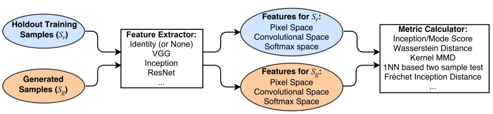

# GAN_Metrics-Tensorflow
Simple Tensorflow implementation of metrics for GAN evaluation
* Inception score
* Frechet-Inception distance
* Kernel-Inception distance

<div align="center">
  
</div>

## Summary
*Name* | *Description* | *Performance score* 
:---: | :---: | :---: |
**Inception score** | KL-Divergence between conditional and marginal label distributions over generated data. | Higher is better.
**Frechet-Inception distance** | Wasserstein-2 distance between multi-variate Gaussians fitted to data embedded into a feature space. | Lower is better.
**Kernel-Inception distance** | Measures the dissimilarity between two probability distributions `Pr` and `Pg` using samples drawn independently from each distribution. | Lower is better.

## Usage
```
├── real_source 
    ├── aaa.png
    ├── bbb.jpg
├── real_target 
    ├── ccc.png
    ├── ddd.jpg
├── fake 
    ├── ccc_fake.png
    ├── ddd_fake.jpg
├── main.py
├── inception_score.py
└── frechet_kernel_Inception_distance.py
```

```python
> python main.py
```

## Reference
* [Pros and Cons of GAN Evaluation Measures](https://arxiv.org/pdf/1802.03446.pdf)
* [Inception score](https://github.com/tsc2017/Inception-Score)
* [Frechet-Inception score](https://github.com/tsc2017/Frechet-Inception-Distance)

## Author
Junho Kim
